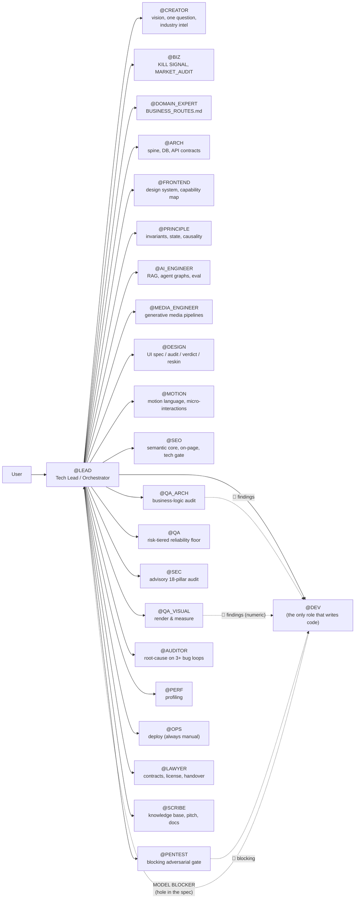

# Architecture

How LEO is actually built: the file layout, the role graph, the gate protocol, and the artifact layers that make long-horizon agentic work survive a context window. This document is the deep-dive companion to [`README.md`](./README.md).

---

## 1. The three physical layers

LEO's own knowledge is split into three layers so the agent never has to load all ~294,000 words at once — it loads the constitution always, and pulls a specific canon only when a task actually needs it. This split only pays off when the agent can actually open a file on demand — see [Compatibility](./README.md#compatibility) in the README for the tool-use requirement this implies.

```
LEO/
├── .cursorrules        # Layer 0 — the constitution. Always loaded. 551 lines: 44 Laws,
│                        # LAW PRECEDENCE, TASK ROUTING, role map, chain protocol, gate map,
│                        # command centre. Everything else is reached FROM here.
├── roles/               # Layer P — process norm. 123 top-level files + 6 under niches/ = 129 files,
│   └── niches/           # ~36,700 lines, ~294,000 words. Loaded on demand via the task router.
│                          # niches/ holds 5 domain-bootstrap packages (CRM/ERP, marketplace,
│                          # mobile-consumer, content/social, AI-assistant) picked once at project start.
└── docs/                # Layers S + W — product state & working artifacts.
    ├── product_state/   #   Layer S: passports generated FROM the code (facts, not intentions)
    ├── artifacts/        #   Layer W: architecture spine, DEV_PROMPTS, QA_REPORTs, ADRs — the
    │                      #   actual inter-role interface. This is what "state, not history" means.
    ├── decisions/         #   Individual ADRs
    ├── knowledge/          #   Business logic, business routes, market audit
    ├── execution/           #   Wave-by-wave implementation playbooks
    ├── archive/              #   Superseded artifacts, kept for history rather than deleted
    ├── commercial/            #   Client-facing commercial pack (proposals, SOWs) when applicable
    └── operations/             #   Deploy/CI runbooks, incident notes
```

**Why this split matters for context engineering:** a single giant prompt degrades as it grows — instructions bury each other, and the model starts pattern-matching on proximity instead of relevance. LEO instead keeps one small, always-loaded constitution (`.cursorrules`) whose `TASK ROUTING` block hands off to `roles/RAG_CANON.md` §2 — the task router that names *which files to read, in which order*, for this specific situation. The agent pulls those files and nothing else. This is retrieval-augmented prompting applied to the *rules themselves*, not just to the codebase.

**A library this size only works because nothing in it is reached by browsing.** Section 3 below describes the router; the property that makes it load-bearing is that it is maintained by rule rather than by discipline — every canon must be reachable from a task class or a categorical group, and every path the router names must resolve on disk. Both are checked on entry to any system-evolution task. **A canon the router does not know about does not exist**, which is a harsher rule than it sounds: it means adding a file to `roles/` is not how you add a rule to LEO.

**One honest exception to "universal canon":** twelve files (`TPF_MASTER.md`, `TPF_MODULE_*.md`) are not a template — they're a real, filled-in UI/UX reference passport from MedCore's admin panel, and they say so in their own first line (`PROJECT EXAMPLE — dental Business OS, NOT a universal canon`). `roles/SYSTEM_FILES_MASTER.md` already flags them for relocation to `docs/artifacts/reference/tpf/` on a clean project; they're kept in `roles/` here as a concrete, non-hypothetical example of what a filled-out module passport looks like, not as something a new project should inherit by default.

---

## 2. The role graph

`@LEAD` is not a role among equals — it is the only role the user talks to directly in the default flow. Every other role is reached through a **hand-off**, and every hand-off has a fixed shape (the Transmission Protocol, below). This keeps the system a **star topology with one router**, not a free-for-all where 22 personas argue with each other in the same context.



Every arrow that isn't a dotted "escalation" line is a **hand-off with an artifact**, never a bare conversational request. `@ARCH` does not tell `@DEV` what to build in chat — it writes `docs/artifacts/SAAS_ARCHITECTURE_SPINE_2026.md`, and `@DEV` reads that file.

### Role jurisdictions at a glance

| Domain | Owning role | Escalates to |
|---|---|---|
| Product vision, one clarifying question, market fit | `@CREATOR` | `@BIZ`, `@DOMAIN_EXPERT` |
| Kill-signal check, feature ROI, competitor analysis | `@BIZ` | `@LEAD` (business decision) |
| Business routes — money, roles, critical journeys | `@DOMAIN_EXPERT` | `@ARCH` |
| Stack, database, API contracts, the 12-vertebra architecture spine | `@ARCH` | `@PRINCIPLE` (model disputes), `@PENTEST` (surface touched) |
| Reading the actual backend to map what the UI *could* surface (the Capability Map) | `@FRONTEND` | `@DESIGN` (consumes the map before spec'ing a screen) |
| Invariants, state reachability, causality, concurrency correctness | `@PRINCIPLE` | `@ARCH` (contract fix), `@BIZ` (undecided rule) |
| RAG pipelines, embeddings, ANN backends, executable agent graphs | `@AI_ENGINEER` | `@PRINCIPLE` (money/state + agent effects jointly) |
| AI-generated photo/video/3D media pipelines | `@MEDIA_ENGINEER` | — |
| UI pattern/composition decisions, design conflicts | `@DESIGN` | `@FRONTEND` (capability map first) |
| Motion language, micro-interactions | `@MOTION` | `@DESIGN` |
| Search-visibility architecture, on-page structure, SSR/SSG gate | `@SEO` | `@ARCH` (rendering ADR) |
| **All code** | `@DEV` | `@LEAD` (MODEL BLOCKER routing) |
| Business-logic / state-matrix / async-safety audit before release | `@QA_ARCH` | `@DEV` (fix list) |
| Rendered-UI geometry, layout invariants, hostile-content states | `@QA_VISUAL` | `@DEV`, `@DESIGN`, `@MOTION` |
| Risk-tiered test floor, negative baseline, release gate | `@QA` | — |
| Advisory 18-pillar security checklist | `@SEC` | `@PENTEST` (blocking authority) |
| Adversarial threat modeling and red-team — **blocking**, peer to `@QA_VISUAL` | `@PENTEST` | `@LEAD` (risk acceptance, human-owned) |
| Root cause after 2+ failed fix attempts | `@AUDITOR` | `@LEAD` (routes by hole shape) |
| Profiling, performance | `@PERF` | — |
| Deploy — **always manual**, chain stops before it | `@OPS` | — |
| Contracts, licensing, client handover | `@LAWYER` | — |
| Product knowledge base, pitch, user docs | `@SCRIBE` | `@LEAD` (gaps as `[UNDOCUMENTED]`) |

---

## 3. The task router — how 129 files stay usable

Every task begins by being **classified**, not by being read into. `@LEAD` writes `CLASS: TC-xx` in the first line of the reply, and `roles/RAG_CANON.md` §2 answers what that class reads: **at most six files, in a stated order**, with a section pointer where the canon is large, plus an explicit **OUT list** naming what the neighbouring class owns instead.

There are 22 classes, `TC-00` through `TC-21`. The split is by *what kind of wrongness is possible*, not by team or by folder:

| Group | Classes | Why they are grouped |
|---|---|---|
| Surfaces | `TC-01` operational-screen · `TC-02` public-screen · `TC-03` statement-surface · `TC-04` node-graph · `TC-05` visual-concept | the **register** decides the canon — an admin table and a landing page are graded by partly opposite rules (Law 33), and the sharpest OUT lists in the router sit on this boundary |
| Machinery | `TC-06` backend-slice · `TC-07` async-pipeline · `TC-08` integrity/tenancy · `TC-09` migration · `TC-10` security-surface | a wrong answer is a production incident, not a taste dispute |
| Decisions | `TC-11` model · `TC-12` architecture · `TC-13` ai-contour · `TC-14` visibility · `TC-17` product-package | expensive to reverse, so they are read into first and modelled before they are structured |
| Process | `TC-15/16` a QA pass itself · `TC-18` execution-planning · `TC-19` documentation · `TC-20` system-evolution · `TC-21` operations · `TC-00` trivial | including the class for **auditing an audit**, and `TC-00`, which forbids ceremony on a one-line fix |

**Three properties keep this a router and not a bureaucracy:**

- **A floor, never a ceiling.** The class minimum states what must be read *first* and *in what order*, because the failure it removes is *not knowing where to start* — not curiosity. Any role may open any other file and say so in the report. Reading beyond the minimum is normal work.
- **Cascade, not override.** Laws → task class → the acting role's own reading map. A role may **add** to its class minimum; it may never **drop** from it. Where both name the same canon, the more specific section pointer wins.
- **A hard budget.** Six files per class, and a class whose six files run past roughly 100 KB is over budget — trimmed by naming sections, never by silently dropping a canon. A class that needs a seventh file is the signal that the class is wrong or that two canons should be merged.

**Three orderings exist in LEO and they are deliberately different things** — confusing them is itself a recurring finding: the **router** orders *files to read*; **LAW PRECEDENCE** orders *laws in conflict*; **Law 13** orders *values inside one decision* (correctness → completeness → quality → speed). A fourth, `RAG_CANON` §1, orders *sources when two documents describe the project differently* — and the laws are deliberately not on it, because they are the frame every layer below is written inside.

---

## 4. The Chain Protocol — gates, not steps

The core discipline of LEO is that **a phase transition is never automatic.** Every step below is a gate: it requires a concrete artifact, not an assertion, before the chain advances.

```mermaid
flowchart TD
    T["Task arrives"] --> CLS["@LEAD resolves the class\nCLASS: TC-xx → the ≤6 files to read"]
    CLS --> G0{"PRE-PLAN GATE\n7 points: market audit,\nkill signal, business routes…"}
    G0 -->|missing| STOP1["STOP — return to\n@CREATOR / @BIZ"]
    G0 -->|OK| LPA["Leverage Point Analysis\n(6 lenses, non-trivial tasks)"]
    LPA --> M{"New module?\nTouches state/money/authority?"}
    M -->|yes| MODEL["@PRINCIPLE MODE:MODEL\n— BEFORE architecture, not after"]
    M -->|no| FOUND
    MODEL --> FOUND
    FOUND{"Touches the foundation?\n(data model, RBAC, security,\ntenancy, design concept)"}
    FOUND -->|yes| COMPLETE["FORESIGHT / COMPLETENESS GATE\nfull production rollup, not an MVP slice"]
    COMPLETE --> COST["COST GATE (Law 43)\ntier E1–E4 declared in decisions reopened\nbefore the first hand-off"]
    FOUND -->|no| COST
    COST --> ARCHSTEP["@ARCH / @FRONTEND\ndraft the spine"]
    ARCHSTEP --> CRIT{"Critical model?\n(money, statuses, concurrency)"}
    CRIT -->|yes| PRIN["@PRINCIPLE verdict\n🟢 / 🟡 / 🔴"]
    CRIT -->|no| AI
    PRIN --> AI
    AI{"AI contour touched?\n(RAG, agent graph, embeddings)"}
    AI -->|yes| AIENG["@AI_ENGINEER\nRAG_PASSPORT / AGENT_GRAPH_PASSPORT / EVAL_PLAN"]
    AI -->|no| SURF
    AIENG --> SURF
    SURF{"Security surface touched?\n(S1–S12, mechanical grep of the diff)"}
    SURF -->|"yes"| S0["@PENTEST S-0 THREAT_MODEL\n→ Security Contract INSIDE DEV_PROMPTS"]
    SURF -->|"no"| PROMPTS
    S0 --> PROMPTS["DEV_PROMPTS file finalized\n(numbered to-dos, contracts, domain checklist)"]
    PROMPTS --> DEVSTEP["@DEV executes to-dos, writes code"]
    DEVSTEP --> QAA{"@QA_ARCH audit"}
    QAA -->|"red flag"| DEVSTEP
    QAA -->|"green, UI change"| QAV["@QA_VISUAL\nrender, measure, compare"]
    QAA -->|"green, no UI"| QASTEP
    QAV -->|"red flag"| DEVSTEP
    QAV -->|"green"| QASTEP["@QA — risk-tiered gate"]
    QASTEP --> SEC2["@SEC + @PENTEST S-Wave\n+ @SEO TECH (public site)"]
    SEC2 -->|"red flag"| DEVSTEP
    SEC2 -->|"green"| SP["SECOND PASS — clean context\nnew chat, broad instruction,\nrole set looked up from the class"]
    SP -->|"finding"| DEVSTEP
    SP -->|"clean"| HUMAN["Human review\nHuman publishes (Law 40)"]
```



**Why gates and not a linear pipeline:** a linear pipeline lets the agent "complete" a phase by declaring it complete. A gate requires an *artifact a different pass can check against a criterion* — `roles/LEAD_ANTI_CHECKBOX_PROTOCOL.md` exists specifically to catch phrases like "practically done" or "should work now" and force a concrete verification instead.

---

## 5. Artifact layers — "state, not history"

The single most important idea in LEO, and the direct answer to context drift: **decisions live in files that get read, not in chat history that gets forgotten.**

| Layer | Location | What it holds | Who writes it | Who reads it next |
|---|---|---|---|---|
| **P — Process norm** | `roles/*.md` | The rules themselves — how any role should behave | The human (via `@EVOLVE`, never the agent alone) | Every role, on demand |
| **S — Product state** | `docs/product_state/` | Passports generated *from the actual code* — facts, not plans | `@SCRIBE`, generated rollups | Any role needing ground truth; wins on conflict with W |
| **W — Working artifacts** | `docs/artifacts/`, `docs/decisions/` | Architecture spine, `DEV_PROMPTS_*`, `QA_REPORT_*`, ADRs, `PRINCIPLE_FINDINGS_*` | `@ARCH`, `@DEV`, `@QA_ARCH`, `@PRINCIPLE`, … | The next role in the chain, and the next session of the same role |

Concretely: if `@ARCH` decides "tenancy is Organization → Clinic, enforced by `clinic_id` + `organization_id`, not by RLS alone," that decision is not a sentence in chat that the next context window has to re-derive or re-guess. It is a line in `SAAS_ARCHITECTURE_SPINE_2026.md`. Three weeks and forty conversations later, a fresh agent session with zero chat history reads that file and inherits the decision exactly, instead of silently re-deciding it — possibly differently — because nobody told it not to.

This is why a code-first / spine-first mismatch is treated as a hard signal: `roles/ENGINEERING_PLAN.md` §5 states plainly that when the markdown and the code disagree, **the code wins**, and the artifact gets updated — never the other way around. Artifacts describe reality; they don't get to override it.

---

## 6. The 12-vertebra Architecture Spine (`ARCH_SPINE_PROTOCOL.md`)

Any architectural trigger — new service, new store, new integration, schema change, public contract, tier change — has to answer **12 numbered questions**, each closed with a number or a canon reference, never with a general sentence:

1. Complexity-ladder tier (rise a tier only on a numeric trigger — "for growth" is rejected)
2. SLO class
3. Tenancy model + a leak test
4. Timeouts on every outgoing dependency (a call without a timeout "does not exist")
5. Mutation idempotency
6. Constraints-first data integrity (→ the Invariant Ledger)
7. Additive-only public contracts
8. Job/pipeline passports for background work
9. Capacity, expressed as a number
10. Failure modes and blast radius
11. Disaster-recovery class, with the **date of the last actual restore test**
12. A STRIDE threat-model sketch

`@QA_ARCH`'s "Spine vector" is a literal grep for an outgoing call without a timeout, or a vertebra answered with prose instead of a number — either is an automatic 🔴.

---

## 7. Security as a blocking gate, not a checklist (`SECURITY_GATE_PROTOCOL.md`)

Security has three checkpoints, and none of them are optional once a touched surface (S1–S12: identity, authz/tenant boundary, money, IDOR, untrusted-input→sink, SSRF, files, webhooks, secrets/PII, public exposure, background jobs, infra-as-code) is detected by a **mechanical grep of the diff** — not a feeling:

| Checkpoint | When | Output |
|---|---|---|
| **S-0** | Planning, before `DEV_PROMPTS` is final | A `## Security Contract` written *into* `DEV_PROMPTS` — abuse cases with a named guarantee, before code exists |
| **S-Wave** | End of every wave, inside GATE-4 | `@PENTEST` adversarial pass; any 🔴 blocks deploy; every finding gets a red-green regression test |
| **S-Global** | Before every pilot / release tag / surface-widening change | Full `GLOBAL_AUDIT` |

`@PENTEST` holds a genuinely **blocking** verdict — the same authority class as `@QA_VISUAL` holds over rendered geometry. A 🔴 is never risk-accepted silently; a 🟠/🟡 can only be accepted by a *named human owner*, logged with a time-box.

---

## 8. Data integrity under concurrency (`DATA_INTEGRITY_CANON.md`)

Every business invariant — "no double-booking," "no overselling," "pay once" — is required to be protected at a level that **cannot be bypassed by a race**:

- Database schema (`UNIQUE`, partial unique, `CHECK`, exclusion constraints), or
- Explicit locking/versioning (`SELECT … FOR UPDATE`, optimistic version + `409`, atomic `UPDATE` guards, advisory locks)

An `if` check in application code is explicitly declared **not protection** — "a UX hint," in the system's own words — because it fails exactly when two requests race, which is precisely when the invariant matters. Mutating `POST`s get an `Idempotency-Key`; webhooks get inbox-dedup by `event_id`; money is integer minor units on every layer, never float.

---

## 9. The database as a live resource with a clock (`DATABASE_RUNTIME_CANON.md`)

A connection, a transaction, and a lock are resources somebody is holding — for each, the system requires an explicit answer to *who holds it, for how long, and what happens if they die*. Concretely, every architecture spine carries numeric session guard rails: `lock_timeout`, `idle_in_transaction_session_timeout`, `statement_timeout`. Law 35's own text names the failure mode directly — a held transaction becoming a lock-holding corpse, and a "Cancel" button that queues behind the very job it was supposed to cancel — though unlike Laws 30/32/38 this canon doesn't have its own dated entry in `roles/SYSTEM_UPGRADE_MANIFEST.md` (the manifest documents highlights, not every version).

---

## 10. Async workers on three planes (`ASYNC_WORKERS_CANON.md`)

Background work is designed across **three separate planes** so cancellation, execution, and monitoring never collide:

- **Data plane** — the actual task payload and queue
- **Control plane** — cancellation is a *flag the executor checks at checkpoints*, never a task injected into the data queue
- **Supervision plane** — the only plane allowed to kill a worker; a worker never waits for, polls, or kills another worker

Thirteen numbered laws (AW-1…13) cover retry taxonomy (retryable vs. fatal, one retry owner per error class), a mandatory dead-letter queue, `SKIP LOCKED` recovery paths that never queue behind what they're recovering, and a **lease model** where "heartbeat" is redefined as *progress*, not just a pulse — a task that pings but doesn't advance its cursor is still a zombie.

---

## 11. Craft is engineered, not vibed

Two "registers" get explicitly different rulebooks, because applying the wrong one produces a specific, named failure:

- **`instrument`** (admin panels, dashboards, tools) → `VISUAL_CRAFT_CANON.md` + `INTERFACE_CRAFT_CANON.md`: restraint *is* the craft — one separation method per surface, one light source, chrome that whispers.
- **`statement`** (landing pages, hero sections, campaigns) → `EDITORIAL_CRAFT_CANON.md`: **partly opposite laws** — scale as a weapon, deliberate asymmetry, one gesture committed to completely. *"Applying instrument-restraint to a showcase is exactly how a landing becomes a settings screen with a big button on it."*

Both registers have a numbered detector (`X1–X12` cheapness, `ST1–ST12` stiffness, `Y1–Y12` timidity) that `@QA_VISUAL` and `@DESIGN` run against a render — not against a description of the render.

---

## 12. `@EVOLVE` — the only way the system changes itself

LEO can amend its own rules after an incident, but strictly on a human command:

```
@EVOLVE: [what happened, in one line]
```

This triggers evidence-gathering → root-cause analysis ("was this a knowledge gap, or an execution failure that a grep would have caught?") → a proposed placement (amend in place > extend an existing canon > new canon is rare > new Absolute Law is rarest) → an explicit **cost question** ("this rule gets read on every future request, forever — does it earn that?") → a human-approved plan → the edit → a line in `SYSTEM_UPGRADE_MANIFEST.md`.

Rejecting an `@EVOLVE` proposal is an explicitly valid, healthy outcome — most of the time the fix is *"this was an execution failure, not a knowledge gap; add a grep, not a law."*

---

## 13. The second pass — the only auditor that is not the author

Everything in section 4 is a gate the *same session* passes. That session is structurally the worst available judge of its own output: it remembers what it meant, so it reads its own intention back out of the file; it already argued itself into every shortcut it took; and it holds the whole build in context, which is precisely what makes a hole invisible. `roles/SECOND_PASS_PROTOCOL.md` puts the fix in the plan rather than in good intentions.

**The three conditions that make a pass a second pass** — drop any one and it degrades into a re-read:

1. **A clean context.** A new chat that never saw the unit being built. Continuing in the same session is not an audit, it is the author agreeing with the author.
2. **A broad search instruction, never a narrowed checklist.** A checklist tells the auditor what to find, and an auditor told what to find stops looking. The instruction names the surface, not the expected findings.
3. **A role set looked up from the task class**, not improvised. It is a **default and not a permission list**: no role is excluded by the table, and no set is complete merely because the table names it. What the lookup removes is the blank page, not the choice.

**Four levels, and they are slots in the plan:**

| | Runs | Catches |
|---|---|---|
| **SP-0** | before the next unit is pasted | that the *previous* unit actually landed on disk — the cheapest and most-skipped check in agentic work |
| **SP-1** | per delivered unit | the unit against its own acceptance criterion |
| **SP-2** | per stage | the seams between units — where each is individually correct and the join is not |
| **SP-3** | per batch | drift across the whole batch, and the batch's own plan |

A batch map showing only production steps is an **incomplete batch map**. Law 43 explicitly does not count a planned second pass against the declared effort tier: an audit costing several times its unit is the correct price of that unit, not an overrun of it.

**False greens are catalogued, not lamented.** `FG-1`…`FG-12` name the specific shapes a pass takes when it reports 🟢 on something it did not check, with a per-project tally in `docs/artifacts/FALSE_GREEN_REGISTER.md` — the point being that a recurring `FG` number is a fact about the process, not about one report. `TC-15/16` is the class for auditing an audit: spot-check two or three of a report's own claims against the code, because **a green that does not survive re-reading was never green.**

This document's own rule set was rectified this way. A clean-context pass across five waves of changes to LEO found a gate carrying two different numeric thresholds for one countable rule, a source-priority ladder readable as "a project artifact outranks a law", a quality gate applying one visual register's checklist to both registers, and a protocol that had authored the rule *"a canon the router does not know does not exist"* while being itself unregistered. None of those are visible from inside the session that wrote them — not because the session was careless, but because it was the author.

---

## 14. When laws collide — precedence, ownership, and the seven tests

Forty-four laws that all act at once need two things a list of rules does not automatically have: a **ladder** for when two of them pull apart, and a **protocol** for changing one without destroying it.

**The ladder (`LAW PRECEDENCE`, at the top of the constitution).** Five rungs; a higher rung is never overruled by a lower one.

1. **Safety and irreversibility** — the security gate, the human publish gate, licence purity, integrity under concurrency. A 🔴 here is never traded against speed, scope, taste or effort, and never risk-accepted by an agent.
2. **Truth about the current state** — fact-or-admission, prove-the-artifact, logs-before-guesses. *A law whose input is unproven does not apply yet:* establish the state, then reason. This is what keeps a correct rule from being applied to an imagined situation.
3. **Stopping beats proceeding** — when one law says *do* and another says *stop*, stop wins, and every stop is raised in the single format of Law 23 (⚠️ OBJECTION) whatever produced it, so there is one queue rather than five dialects.
4. **The specific narrows the general — inside its declared scope only**, and only where the general law names the exception. A general law with no scope clause is obeyed or amended, never reinterpreted in the moment.
5. **Otherwise the later, more specific law wins**, and the pair is recorded in `CONFLICT_REGISTRY.md` with one named winner, so the same collision is decided once instead of re-argued per task.

**Ownership, and why a repeated rule is not automatically a bug.** A resolution between two laws has exactly one **named** owner: the owning law states it in full, the yielding law carries a pointer that names the owner. Restating a rule in full elsewhere is legitimate — the model does not reliably follow a reference, and a rule governing a frequent decision is cheaper repeated than missed — on one condition: **the restatement names the same owner.** An echo that says whose rule it is repeats; an echo that does not, drifts. What is forbidden is the **unowned copy** — two statements of one rule, neither pointing at the other, which come apart on the first edit with nobody able to tell which half is stale.

**Changing a law: `roles/RULE_INTEGRITY_PROTOCOL.md`.** Seven tests, run on the proposed change **and on the finding that prompted it** — because a mechanically correct audit finding can propose a change that destroys the rule it is about.

| | Test | The failure it catches |
|---|---|---|
| **T0** | **GOAL** — what is this law for, in one sentence? | *smeared centre.* A law carrying two goals enforces neither: the reader satisfies the cheaper one and reports the law as met. This is how a good law dies of a well-meant edit, and an audit adding "completeness" does it routinely |
| **T1** | **AXIS** — register, action, form, order, or fact? | *category error.* A rule is true only on its own axis. Demanding an owner and a gate for a **register** law turns a one-line filter into a procedure and loses the filter |
| **T2** | **HOME** — is this a decision or a meaning? | decisions get one home; meanings are deliberately restated. Collapsing a meaning to one location is where "single source of truth" advice goes wrong in a connected system |
| **T3** | **NAME** | *namespace collision.* `C1` means six different things across the canons; `T1`, five |
| **T4** | **REACH** | a rule whose scope is not stated gets applied where it does not belong |
| **T5** | **SIDES** | a contract known to only one side is not a contract |
| **T6** | **MEASURE** | a metric measuring a shadow of its own claim |

The protocol carries an explicit scope guard, and it matters more than the tests do: *it governs a rule being written or changed — it is not a conformance schema for the laws that already exist. A law that works in practice and does not match this shape is evidence about the shape, not about the law.*

---

## 15. What "22 roles, 44 laws, 129 files" actually buys you

None of this is complexity for its own sake. Each mechanism above maps to a specific, named failure mode of unconstrained agentic coding:

| Failure mode of a raw agent | LEO's countermeasure |
|---|---|
| Forgets a decision from 40 messages ago | Artifacts (layer W) instead of chat history |
| Silently re-decides architecture inside a "quick fix" | Pre-Plan Gate + Foresight/Completeness Gate before `@ARCH` |
| Reports success without checking | Law 12 (fact-or-admission), `LEAD_ANTI_CHECKBOX_PROTOCOL.md` |
| Skips the boring 20% under time pressure | 44 Laws that make skipping *expensive* (a named 🔴, not a style nit) |
| No adversary, no second opinion | `@PENTEST` blocking gate, `@QA_ARCH` audit, `@QA_VISUAL` render checks — separate passes, separate jurisdictions |
| The session that built it is the one grading it | `SECOND_PASS_PROTOCOL.md` — a clean context that never saw the build, with a catalogued list of false greens |
| Doesn't know which of 129 files this task needs | `RAG_CANON.md` §2 — 22 task classes, each naming ≤6 files in reading order |
| Drifts from a small fix into a reconstruction nobody asked for | Law 43 — the effort tier declared up front in decisions reopened, with a countable stop threshold |
| An audit "fixes" a rule and quietly destroys it | `RULE_INTEGRITY_PROTOCOL.md` — seven tests run on the *finding*, not only on the rule |
| Race conditions and double-writes | `DATA_INTEGRITY_CANON.md` — protection at the schema/lock level, not an `if` |
| A background job hangs forever holding a lock | `DATABASE_RUNTIME_CANON.md`, `ASYNC_WORKERS_CANON.md` — numbers, not vibes |
| The agent quietly commits/pushes something nobody reviewed | Law 40 — the human publish gate, with a mandatory refusal script |
| Rules rot as the system grows past what one person can hold in their head | `CONFLICT_REGISTRY.md`, `@EVOLVE`, `SYSTEM_UPGRADE_MANIFEST.md` |

---

See also: [`README.md`](./README.md) for the overview, [`CASE_STUDIES.md`](./CASE_STUDIES.md) for where this ran in production, and [`MANIFESTO.md`](./MANIFESTO.md) for the long-form argument.
