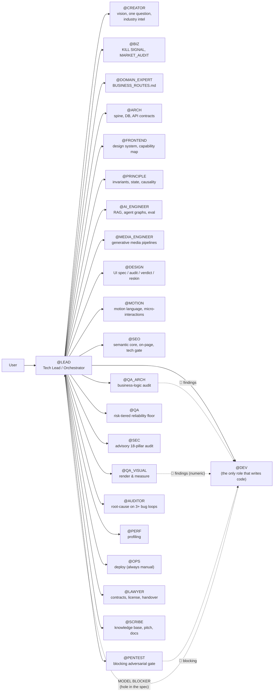

# Architecture

How LEO is actually built: the file layout, the role graph, the gate protocol, and the artifact layers that make long-horizon agentic work survive a context window. This document is the deep-dive companion to [`README.md`](./README.md).

---

## 1. The three physical layers

LEO's own knowledge is split into three layers so the agent never has to load all ~254,000 words at once — it loads the constitution always, and pulls a specific canon only when a task actually needs it. This split only pays off when the agent can actually open a file on demand — see [Compatibility](./README.md#compatibility) in the README for the tool-use requirement this implies.

```
LEO/
├── .cursorrules        # Layer 0 — the constitution. Always loaded. 402 lines: 41 Laws,
│                        # role map, chain protocol, gate map. Everything else is reached FROM here.
├── roles/               # Layer P — process norm. 121 top-level files + 6 under niches/ = 127 files,
│   └── niches/           # ~26,000 lines, ~254,000 words. Loaded on demand by @LEAD's routing table.
│                          # niches/ holds 5 domain-bootstrap packages (CRM/ERP, marketplace,
│                          # mobile-consumer, content/social, AI-assistant) picked once at project start.
└── docs/                # Layers S + W — product state & working artifacts.
    ├── product_state/   #   Layer S: passports generated FROM the code (facts, not intentions)
    ├── artifacts/        #   Layer W: architecture spine, DEV_PROMPTS, QA_REPORTs, ADRs — the
    │                      #   actual inter-role interface. This is what "state, not history" means.
    ├── decisions/         #   Individual ADRs
    ├── knowledge/          #   Business logic, business routes, market audit
    ├── execution/           #   Wave-by-wave implementation playbooks
    ├── archive/              #   Superseded artifacts, kept for history rather than deleted
    ├── commercial/            #   Client-facing commercial pack (proposals, SOWs) when applicable
    └── operations/             #   Deploy/CI runbooks, incident notes
```

**Why this split matters for context engineering:** a single giant prompt degrades as it grows — instructions bury each other, and the model starts pattern-matching on proximity instead of relevance. LEO instead keeps one small, always-loaded router (`.cursorrules`) that names *which file to read* for a given situation, and lets the agent pull that one file only when it's relevant. This is retrieval-augmented prompting applied to the *rules themselves*, not just to the codebase.

**One honest exception to "universal canon":** twelve files (`TPF_MASTER.md`, `TPF_MODULE_*.md`) are not a template — they're a real, filled-in UI/UX reference passport from MedCore's admin panel, and they say so in their own first line (`PROJECT EXAMPLE — dental Business OS, NOT a universal canon`). `roles/SYSTEM_FILES_MASTER.md` already flags them for relocation to `docs/artifacts/reference/tpf/` on a clean project; they're kept in `roles/` here as a concrete, non-hypothetical example of what a filled-out module passport looks like, not as something a new project should inherit by default.

---

## 2. The role graph

`@LEAD` is not a role among equals — it is the only role the user talks to directly in the default flow. Every other role is reached through a **hand-off**, and every hand-off has a fixed shape (the Transmission Protocol, below). This keeps the system a **star topology with one router**, not a free-for-all where 22 personas argue with each other in the same context.



Every arrow that isn't a dotted "escalation" line is a **hand-off with an artifact**, never a bare conversational request. `@ARCH` does not tell `@DEV` what to build in chat — it writes `docs/artifacts/SAAS_ARCHITECTURE_SPINE_2026.md`, and `@DEV` reads that file.

### Role jurisdictions at a glance

| Domain | Owning role | Escalates to |
|---|---|---|
| Product vision, one clarifying question, market fit | `@CREATOR` | `@BIZ`, `@DOMAIN_EXPERT` |
| Kill-signal check, feature ROI, competitor analysis | `@BIZ` | `@LEAD` (business decision) |
| Business routes — money, roles, critical journeys | `@DOMAIN_EXPERT` | `@ARCH` |
| Stack, database, API contracts, the 12-vertebra architecture spine | `@ARCH` | `@PRINCIPLE` (model disputes), `@PENTEST` (surface touched) |
| Reading the actual backend to map what the UI *could* surface (the Capability Map) | `@FRONTEND` | `@DESIGN` (consumes the map before spec'ing a screen) |
| Invariants, state reachability, causality, concurrency correctness | `@PRINCIPLE` | `@ARCH` (contract fix), `@BIZ` (undecided rule) |
| RAG pipelines, embeddings, ANN backends, executable agent graphs | `@AI_ENGINEER` | `@PRINCIPLE` (money/state + agent effects jointly) |
| AI-generated photo/video/3D media pipelines | `@MEDIA_ENGINEER` | — |
| UI pattern/composition decisions, design conflicts | `@DESIGN` | `@FRONTEND` (capability map first) |
| Motion language, micro-interactions | `@MOTION` | `@DESIGN` |
| Search-visibility architecture, on-page structure, SSR/SSG gate | `@SEO` | `@ARCH` (rendering ADR) |
| **All code** | `@DEV` | `@LEAD` (MODEL BLOCKER routing) |
| Business-logic / state-matrix / async-safety audit before release | `@QA_ARCH` | `@DEV` (fix list) |
| Rendered-UI geometry, layout invariants, hostile-content states | `@QA_VISUAL` | `@DEV`, `@DESIGN`, `@MOTION` |
| Risk-tiered test floor, negative baseline, release gate | `@QA` | — |
| Advisory 18-pillar security checklist | `@SEC` | `@PENTEST` (blocking authority) |
| Adversarial threat modeling and red-team — **blocking**, peer to `@QA_VISUAL` | `@PENTEST` | `@LEAD` (risk acceptance, human-owned) |
| Root cause after 2+ failed fix attempts | `@AUDITOR` | `@LEAD` (routes by hole shape) |
| Profiling, performance | `@PERF` | — |
| Deploy — **always manual**, chain stops before it | `@OPS` | — |
| Contracts, licensing, client handover | `@LAWYER` | — |
| Product knowledge base, pitch, user docs | `@SCRIBE` | `@LEAD` (gaps as `[UNDOCUMENTED]`) |

---

## 3. The Chain Protocol — gates, not steps

The core discipline of LEO is that **a phase transition is never automatic.** Every step below is a gate: it requires a concrete artifact, not an assertion, before the chain advances.

```mermaid
flowchart TD
    T["Task arrives"] --> G0{"PRE-PLAN GATE\n7 points: market audit,\nkill signal, business routes…"}
    G0 -->|missing| STOP1["STOP — return to\n@CREATOR / @BIZ"]
    G0 -->|OK| LPA["Leverage Point Analysis\n(6 lenses, non-trivial tasks)"]
    LPA --> M{"New module?\nTouches state/money/authority?"}
    M -->|yes| MODEL["@PRINCIPLE MODE:MODEL\n— BEFORE architecture, not after"]
    M -->|no| FOUND
    MODEL --> FOUND
    FOUND{"Touches the foundation?\n(data model, RBAC, security,\ntenancy, design concept)"}
    FOUND -->|yes| COMPLETE["FORESIGHT / COMPLETENESS GATE\nfull production rollup, not an MVP slice"]
    FOUND -->|no| ARCHSTEP
    COMPLETE --> ARCHSTEP["@ARCH / @FRONTEND\ndraft the spine"]
    ARCHSTEP --> CRIT{"Critical model?\n(money, statuses, concurrency)"}
    CRIT -->|yes| PRIN["@PRINCIPLE verdict\n🟢 / 🟡 / 🔴"]
    CRIT -->|no| AI
    PRIN --> AI
    AI{"AI contour touched?\n(RAG, agent graph, embeddings)"}
    AI -->|yes| AIENG["@AI_ENGINEER\nRAG_PASSPORT / AGENT_GRAPH_PASSPORT / EVAL_PLAN"]
    AI -->|no| SURF
    AIENG --> SURF
    SURF{"Security surface touched?\n(S1–S12, mechanical grep of the diff)"}
    SURF -->|"yes"| S0["@PENTEST S-0 THREAT_MODEL\n→ Security Contract INSIDE DEV_PROMPTS"]
    SURF -->|"no"| PROMPTS
    S0 --> PROMPTS["DEV_PROMPTS file finalized\n(numbered to-dos, contracts, domain checklist)"]
    PROMPTS --> DEVSTEP["@DEV executes to-dos, writes code"]
    DEVSTEP --> QAA{"@QA_ARCH audit"}
    QAA -->|"red flag"| DEVSTEP
    QAA -->|"green, UI change"| QAV["@QA_VISUAL\nrender, measure, compare"]
    QAA -->|"green, no UI"| QASTEP
    QAV -->|"red flag"| DEVSTEP
    QAV -->|"green"| QASTEP["@QA — risk-tiered gate"]
    QASTEP --> SEC2["@SEC + @PENTEST S-Wave\n+ @SEO TECH (public site)"]
    SEC2 -->|"red flag"| DEVSTEP
    SEC2 -->|"green"| HUMAN["Human review\nHuman publishes (Law 40)"]
```



**Why gates and not a linear pipeline:** a linear pipeline lets the agent "complete" a phase by declaring it complete. A gate requires an *artifact a different pass can check against a criterion* — `roles/LEAD_ANTI_CHECKBOX_PROTOCOL.md` exists specifically to catch phrases like "practically done" or "should work now" and force a concrete verification instead.

---

## 4. Artifact layers — "state, not history"

The single most important idea in LEO, and the direct answer to context drift: **decisions live in files that get read, not in chat history that gets forgotten.**

| Layer | Location | What it holds | Who writes it | Who reads it next |
|---|---|---|---|---|
| **P — Process norm** | `roles/*.md` | The rules themselves — how any role should behave | The human (via `@EVOLVE`, never the agent alone) | Every role, on demand |
| **S — Product state** | `docs/product_state/` | Passports generated *from the actual code* — facts, not plans | `@SCRIBE`, generated rollups | Any role needing ground truth; wins on conflict with W |
| **W — Working artifacts** | `docs/artifacts/`, `docs/decisions/` | Architecture spine, `DEV_PROMPTS_*`, `QA_REPORT_*`, ADRs, `PRINCIPLE_FINDINGS_*` | `@ARCH`, `@DEV`, `@QA_ARCH`, `@PRINCIPLE`, … | The next role in the chain, and the next session of the same role |

Concretely: if `@ARCH` decides "tenancy is Organization → Clinic, enforced by `clinic_id` + `organization_id`, not by RLS alone," that decision is not a sentence in chat that the next context window has to re-derive or re-guess. It is a line in `SAAS_ARCHITECTURE_SPINE_2026.md`. Three weeks and forty conversations later, a fresh agent session with zero chat history reads that file and inherits the decision exactly, instead of silently re-deciding it — possibly differently — because nobody told it not to.

This is why a code-first / spine-first mismatch is treated as a hard signal: `roles/ENGINEERING_PLAN.md` §5 states plainly that when the markdown and the code disagree, **the code wins**, and the artifact gets updated — never the other way around. Artifacts describe reality; they don't get to override it.

---

## 5. The 12-vertebra Architecture Spine (`ARCH_SPINE_PROTOCOL.md`)

Any architectural trigger — new service, new store, new integration, schema change, public contract, tier change — has to answer **12 numbered questions**, each closed with a number or a canon reference, never with a general sentence:

1. Complexity-ladder tier (rise a tier only on a numeric trigger — "for growth" is rejected)
2. SLO class
3. Tenancy model + a leak test
4. Timeouts on every outgoing dependency (a call without a timeout "does not exist")
5. Mutation idempotency
6. Constraints-first data integrity (→ the Invariant Ledger)
7. Additive-only public contracts
8. Job/pipeline passports for background work
9. Capacity, expressed as a number
10. Failure modes and blast radius
11. Disaster-recovery class, with the **date of the last actual restore test**
12. A STRIDE threat-model sketch

`@QA_ARCH`'s "Spine vector" is a literal grep for an outgoing call without a timeout, or a vertebra answered with prose instead of a number — either is an automatic 🔴.

---

## 6. Security as a blocking gate, not a checklist (`SECURITY_GATE_PROTOCOL.md`)

Security has three checkpoints, and none of them are optional once a touched surface (S1–S12: identity, authz/tenant boundary, money, IDOR, untrusted-input→sink, SSRF, files, webhooks, secrets/PII, public exposure, background jobs, infra-as-code) is detected by a **mechanical grep of the diff** — not a feeling:

| Checkpoint | When | Output |
|---|---|---|
| **S-0** | Planning, before `DEV_PROMPTS` is final | A `## Security Contract` written *into* `DEV_PROMPTS` — abuse cases with a named guarantee, before code exists |
| **S-Wave** | End of every wave, inside GATE-4 | `@PENTEST` adversarial pass; any 🔴 blocks deploy; every finding gets a red-green regression test |
| **S-Global** | Before every pilot / release tag / surface-widening change | Full `GLOBAL_AUDIT` |

`@PENTEST` holds a genuinely **blocking** verdict — the same authority class as `@QA_VISUAL` holds over rendered geometry. A 🔴 is never risk-accepted silently; a 🟠/🟡 can only be accepted by a *named human owner*, logged with a time-box.

---

## 7. Data integrity under concurrency (`DATA_INTEGRITY_CANON.md`)

Every business invariant — "no double-booking," "no overselling," "pay once" — is required to be protected at a level that **cannot be bypassed by a race**:

- Database schema (`UNIQUE`, partial unique, `CHECK`, exclusion constraints), or
- Explicit locking/versioning (`SELECT … FOR UPDATE`, optimistic version + `409`, atomic `UPDATE` guards, advisory locks)

An `if` check in application code is explicitly declared **not protection** — "a UX hint," in the system's own words — because it fails exactly when two requests race, which is precisely when the invariant matters. Mutating `POST`s get an `Idempotency-Key`; webhooks get inbox-dedup by `event_id`; money is integer minor units on every layer, never float.

---

## 8. The database as a live resource with a clock (`DATABASE_RUNTIME_CANON.md`)

A connection, a transaction, and a lock are resources somebody is holding — for each, the system requires an explicit answer to *who holds it, for how long, and what happens if they die*. Concretely, every architecture spine carries numeric session guard rails: `lock_timeout`, `idle_in_transaction_session_timeout`, `statement_timeout`. Law 35's own text names the failure mode directly — a held transaction becoming a lock-holding corpse, and a "Cancel" button that queues behind the very job it was supposed to cancel — though unlike Laws 30/32/38 this canon doesn't have its own dated entry in `roles/SYSTEM_UPGRADE_MANIFEST.md` (the manifest documents highlights, not every version).

---

## 9. Async workers on three planes (`ASYNC_WORKERS_CANON.md`)

Background work is designed across **three separate planes** so cancellation, execution, and monitoring never collide:

- **Data plane** — the actual task payload and queue
- **Control plane** — cancellation is a *flag the executor checks at checkpoints*, never a task injected into the data queue
- **Supervision plane** — the only plane allowed to kill a worker; a worker never waits for, polls, or kills another worker

Thirteen numbered laws (AW-1…13) cover retry taxonomy (retryable vs. fatal, one retry owner per error class), a mandatory dead-letter queue, `SKIP LOCKED` recovery paths that never queue behind what they're recovering, and a **lease model** where "heartbeat" is redefined as *progress*, not just a pulse — a task that pings but doesn't advance its cursor is still a zombie.

---

## 10. Craft is engineered, not vibed

Two "registers" get explicitly different rulebooks, because applying the wrong one produces a specific, named failure:

- **`instrument`** (admin panels, dashboards, tools) → `VISUAL_CRAFT_CANON.md` + `INTERFACE_CRAFT_CANON.md`: restraint *is* the craft — one separation method per surface, one light source, chrome that whispers.
- **`statement`** (landing pages, hero sections, campaigns) → `EDITORIAL_CRAFT_CANON.md`: **partly opposite laws** — scale as a weapon, deliberate asymmetry, one gesture committed to completely. *"Applying instrument-restraint to a showcase is exactly how a landing becomes a settings screen with a big button on it."*

Both registers have a numbered detector (`X1–X12` cheapness, `ST1–ST12` stiffness, `Y1–Y12` timidity) that `@QA_VISUAL` and `@DESIGN` run against a render — not against a description of the render.

---

## 11. `@EVOLVE` — the only way the system changes itself

LEO can amend its own rules after an incident, but strictly on a human command:

```
@EVOLVE: [what happened, in one line]
```

This triggers evidence-gathering → root-cause analysis ("was this a knowledge gap, or an execution failure that a grep would have caught?") → a proposed placement (amend in place > extend an existing canon > new canon is rare > new Absolute Law is rarest) → an explicit **cost question** ("this rule gets read on every future request, forever — does it earn that?") → a human-approved plan → the edit → a line in `SYSTEM_UPGRADE_MANIFEST.md`.

Rejecting an `@EVOLVE` proposal is an explicitly valid, healthy outcome — most of the time the fix is *"this was an execution failure, not a knowledge gap; add a grep, not a law."*

---

## 12. What "22 roles, 41 laws, 127 files" actually buys you

None of this is complexity for its own sake. Each mechanism above maps to a specific, named failure mode of unconstrained agentic coding:

| Failure mode of a raw agent | LEO's countermeasure |
|---|---|
| Forgets a decision from 40 messages ago | Artifacts (layer W) instead of chat history |
| Silently re-decides architecture inside a "quick fix" | Pre-Plan Gate + Foresight/Completeness Gate before `@ARCH` |
| Reports success without checking | Law 12 (fact-or-admission), `LEAD_ANTI_CHECKBOX_PROTOCOL.md` |
| Skips the boring 20% under time pressure | 41 Laws that make skipping *expensive* (a named 🔴, not a style nit) |
| No adversary, no second opinion | `@PENTEST` blocking gate, `@QA_ARCH` audit, `@QA_VISUAL` render checks — separate passes, separate jurisdictions |
| Race conditions and double-writes | `DATA_INTEGRITY_CANON.md` — protection at the schema/lock level, not an `if` |
| A background job hangs forever holding a lock | `DATABASE_RUNTIME_CANON.md`, `ASYNC_WORKERS_CANON.md` — numbers, not vibes |
| The agent quietly commits/pushes something nobody reviewed | Law 40 — the human publish gate, with a mandatory refusal script |
| Rules rot as the system grows past what one person can hold in their head | `CONFLICT_REGISTRY.md`, `@EVOLVE`, `SYSTEM_UPGRADE_MANIFEST.md` |

---

See also: [`README.md`](./README.md) for the overview, [`CASE_STUDIES.md`](./CASE_STUDIES.md) for where this ran in production, and [`MANIFESTO.md`](./MANIFESTO.md) for the long-form argument.
