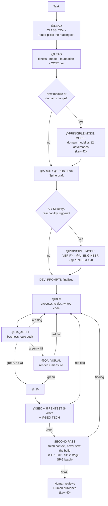

<div align="center">

# LEO
### Lead Engineering Orchestrator

**A Context-Driven Agentic SDLC Framework.**
A written constitution that turns a general-purpose LLM coding agent into a disciplined engineering organization — with a Tech Lead, 22 specialist roles, 44 codified engineering laws, a task router, and a gate protocol that refuses to let "it works on my machine" pass for "done."

[](./LICENSE)
[](./CASE_STUDIES.md)
[](./ARCHITECTURE.md)
[](#4-forty-four-laws-forged-from-incidents-not-opinions)
[](#2-every-task-is-classified-before-it-is-started)
[](#compatibility)

[What it is](#what-leo-actually-is) · [Why it exists](#why-this-exists) · [How it works](#how-it-works) · [Proof at scale](#proof-at-scale) · [Get started](#get-started) · [The Manifesto](./MANIFESTO.md) · [License](#license)

</div>

---

## TL;DR

LEO is not a Python package and there is nothing to `pip install`. It is a **rule system**: a `.cursorrules` constitution plus a **129-file, ~36,700-line, ~294,000-word role library** (`roles/*.md`, including 5 niche-bootstrap packages under `roles/niches/`) that you hand to a coding agent — Cursor, Claude Code, Windsurf, or anything else with file-system/tool access that reads a system-prompt / project-rules file — instead of a one-line "you are a helpful senior engineer" prompt.

Where a raw LLM agent free-improvises architecture, skips edge cases under time pressure, and silently forgets a decision it made 40 messages ago, LEO gives it:

- **A single entry point** (`@LEAD`) that routes every request to the right specialist instead of one model trying to be architect, developer, and QA simultaneously in the same breath.
- **A task router** that resolves every request into one of **22 task classes** (`TC-00`…`TC-21`) and names the ≤6 files to read *first*, in order — so the agent never opens a 129-file library wondering where to start, and never starts a screen without the canon that governs it.
- **22 specialist roles** with narrow, named jurisdictions — `@ARCH`, `@DEV`, `@PRINCIPLE`, `@QA_ARCH`, `@QA_VISUAL`, `@PENTEST`, `@SEO`, `@DESIGN`, `@AI_ENGINEER`, and 13 more — so "who decides this" is never a coin flip.
- **44 Absolute Laws** distilled from real production incidents (double-booked appointments, zombie Celery workers, leaked UUIDs in a UI, a `Promise.all` that silently ate an error) — so the same class of bug cannot recur, because the rule that would have caught it is now permanent.
- **A gate protocol (GATE-0 → GATE-6)** that blocks the chain from advancing without a concrete artifact as proof — never on the agent's word alone.
- **A second pass in a clean context** — every delivered unit is re-audited by an agent that never saw it being built, because the session that wrote the code is the worst possible judge of whether the code is finished.
- **Artifacts instead of chat history** — every architectural decision, security threat model, and QA verdict lives in a versioned markdown file the *next* agent session reads before doing anything, closing the single biggest failure mode of long-running agentic work: **context drift**.

LEO has been directing real, shipped engineering work — not toy demos — across a multi-tenant healthcare SaaS, an AI training platform with RAG and executable agent graphs, and a public-facing marketing + CMS platform. See [Proof at scale](#proof-at-scale).

---

## Why this exists

Autonomous coding agents fail in a very specific, very boring way. Not by writing bad syntax — modern LLMs write syntactically fine code all day. They fail by:

- **Forgetting the decision they made an hour ago** and quietly re-deciding it differently three files later (context drift).
- **Skipping the boring 20%** — the empty state, the error contract, the race condition, the timeout on the outgoing call — because nothing in the prompt made skipping it *expensive*.
- **Hallucinating confidence.** "Most likely implemented," "should work now," "practically done" — phrases that mean *I did not check*, delivered with the same tone as a verified fact.
- **Never being told no.** A single-agent chat has no adversary, no auditor, no separate pair of eyes — so a hole in the logic ships exactly as fast as the happy path does. And the session that wrote the code cannot supply that second pair of eyes, because it remembers what it *meant* and reads its own intention back out of the file.

None of this is a model-capability problem. It is a **process** problem — the same one software engineering solved decades ago with code review, QA, and architecture sign-off, and then re-broke the moment "just ask the AI" became a viable way to skip all three.

LEO is that process, written down as a constitution the agent cannot talk itself out of, because it is loaded as its operating rules, not as a suggestion in a chat bubble.

---

## What LEO actually is

| LEO is | LEO is not |
|---|---|
| A **rules + role-prompt library** your coding agent loads as its system prompt / project rules | A Python/Node package, a CLI, or a hosted service |
| A **process framework** — in the sense that Scrum, TOGAF, or the C4 model are frameworks: a way of organizing work, not a runtime you execute | A finished product, an IDE plugin, or "AutoGPT with extra steps" |
| **Agent-agnostic.** The constitution (`.cursorrules`) works as a system prompt anywhere; the full on-demand role library needs an agent with file-read/tool access (Cursor, Claude Code, Windsurf, Copilot Workspace agent mode) — see [Compatibility](#compatibility) | Tied to one vendor or one model |
| **Opinionated on purpose.** 44 Laws, not 4 — because "use your judgment" is exactly the instruction that produces context drift at scale | A generic "be a good assistant" prompt |
| **Text you read, edit, and own.** Every rule is a markdown file in this repo. You can delete a canon you don't need in five minutes | A black box, a fine-tuned model, or a magic prompt nobody can inspect |

If you came here expecting `npm install leo-orchestrator`, you'll be disappointed. If you came here because your AI pair programmer keeps forgetting what it decided two files ago and shipping a UUID in the UI, keep reading.

---

## How it works

### 1. One entry point, not one model wearing every hat

`@LEAD` is the Tech Lead. It never writes code. It reads the request, decides which specialist owns it, and — critically — runs four gates *before* anything gets built, in this order, so that architecture-scale decisions don't get made accidentally inside a "quick fix":

**fitness** (should this exist at all?) → **model** (does this touch states, money, authority, lifecycles? then the domain model comes before the structure — Law 42) → **foundation** (is this the load-bearing 20% that cannot be redone later? then it is built in full, today — Law 41) → **cost** (what tier of effort is this result worth, counted in decisions reopened — Law 43).

Cost is declared last on purpose: you cannot know the tier until the model and the foundation questions are answered. And the declaration is one line, written before the first hand-off — `COST: goal=… tier=E2 · reopens=[ADR-031, spine v4]` — because an undeclared tier is an undeclared budget, and a budget nobody declared is a budget nobody can overrun.

### 2. Every task is classified before it is started

A 129-file rule library has an obvious failure mode: the agent does not know which handful of files this particular task actually needs, so it either reads nothing or grep-wanders. `roles/RAG_CANON.md` §2 is the router that closes it. `@LEAD` names the class in the first line of the reply — `CLASS: TC-03` — and the class states the **≤6 files to open, in that order**, with a section pointer where the canon is large, plus an explicit **OUT list** of what is deliberately not in scope for it.

| | |
|---|---|
| `TC-01` operational-screen · `TC-02` public-screen · `TC-03` statement-surface · `TC-04` node-graph · `TC-05` visual-concept | the register decides the canon: an admin table and a landing page are graded by **partly opposite** rules |
| `TC-06` backend-slice · `TC-07` async-pipeline · `TC-08` integrity/tenancy · `TC-09` migration · `TC-10` security-surface | the classes where a wrong answer is a production incident, not a taste dispute |
| `TC-11` model · `TC-12` architecture · `TC-13` ai-contour · `TC-14` visibility · `TC-17` product-package | the decisions that are expensive to reverse, so they get read into first |
| `TC-15/16` QA pass · `TC-18` execution-planning · `TC-19` documentation · `TC-20` system-evolution · `TC-21` operations · `TC-00` trivial | including the class for *auditing an audit* — and `TC-00`, which forbids ceremony on a one-line fix |

Three properties make this a router and not a whitelist: **it is a floor, never a ceiling** — any role may open any other file and say so; **a role may add to its class minimum but never drop from it**; and the router is **maintained by rule** — every canon must be reachable from a class or a categorical group, and every path named in it must resolve on disk, checked on entry to any `TC-20` task. A canon the router does not know about does not exist.

### 3. Twenty-two roles with a real jurisdiction, not a personality

| Role | Owns | Typical veto power |
|---|---|---|
| `@ARCH` | Stack, DB, API contracts, the architecture spine | No epic reaches `@DEV` without 12 numbered architectural decisions on record |
| `@PRINCIPLE` | Invariants, state reachability, causality, concurrency | Blocks a feature that is *technically buildable* but *logically unsound* (e.g., a state the domain should never allow) |
| `@DEV` | The only role allowed to write code | Can raise a **MODEL BLOCKER** — refuses to type over a hole in the spec instead of guessing |
| `@QA_ARCH` | Business-logic audit: state matrix, UUID-in-UI, error contract, async safety | Nothing reaches release without a 🟢 verdict here first |
| `@QA_VISUAL` | Renders the UI and *measures* it — overflow, layout shift, hover states — under adversarial content | Geometry claims are verified by render, never by reading code and hoping |
| `@QA` | The final risk-tiered reliability floor (T0–T3) and negative-path baseline | Nothing reaches `@SEC`/`@PENTEST`'s S-Wave gate without this pass first |
| `@PENTEST` | Adversarial security — a **blocking** gate, peer to QA, not an afterthought | Any 🔴 finding stops the deploy; risk-acceptance requires a named human owner |
| `@FRONTEND`, `@SEO`, `@DESIGN`, `@MOTION`, `@AI_ENGINEER`, `@MEDIA_ENGINEER` | Capability mapping, search visibility, UI craft, motion/interaction, RAG & agent graphs, generative media | Each owns a mandatory artifact before the adjacent role can proceed |
| `@BIZ`, `@DOMAIN_EXPERT`, `@CREATOR` | Market fit, domain routes, product vision | Gate the chain before any code gets written on an unvalidated idea |
| `@SEC`, `@AUDITOR`, `@PERF`, `@OPS`, `@LAWYER`, `@SCRIBE` | Advisory security, root-cause diagnosis, profiling, deploy, legal, documentation | Called on trigger, not on a fixed schedule |

Full map, jurisdictions, and hand-off contracts: [`ARCHITECTURE.md`](./ARCHITECTURE.md).

### 4. Forty-four laws, forged from incidents, not opinions

A sample — the full list lives in [`.cursorrules`](./.cursorrules):

- **Law 8 — No UUIDs in the UI.** Displayed names are always resolved. A raw `entity_id` on screen is a 🔴 blocker.
- **Law 11 — Async safety.** Every `async` block has a real `try/catch` with structured logging; `Promise.all` with mutations is banned in favor of `Promise.allSettled` + a per-result status check. A forgotten `await` is treated as "a silent bomb," not a style nit.
- **Law 12 — Fact or an admission of not knowing.** "Probably implemented," "most likely present" are banned phrases. The only allowed answers are *"Verified: [file, line, evidence]"* or *"Could not determine: [reason]."*
- **Law 27 — License purity.** Every dependency is checked against an allowlist before it ships; GPL/AGPL/SSPL/unknown-license is a blocking 🔴, no exceptions, no "we'll swap it later."
- **Law 32 — Integrity under concurrency.** "No double-booking," "no overselling," "pay once" are protected at the database level (unique constraints, `SELECT FOR UPDATE`, idempotency keys) — an `if` check in application code is explicitly declared *not* protection.
- **Law 35 — The database has time too.** `lock_timeout`, `idle_in_transaction_session_timeout`, and `statement_timeout` are numbers in the architecture spine, not vibes. *"If your Cancel button can queue behind the thing it is cancelling, you do not have a Cancel button."*
- **Law 38 — Security is a gate, not a phase.** A threat model is written *before* the first line of code touching a security-relevant surface, not audited in afterward.
- **Law 40 — The human publish gate.** The agent prepares everything up to a commit-ready state and **never** runs `git commit`, `git push`, or `git merge` — not even if the user pastes the exact commands and asks twice. Publishing history is a human action, always.
- **Law 41 — Production-readiness by default.** *"MVP" is a delivery schedule, never a quality bar.* The foundation — data model, RBAC, security surface, money routes — is designed for the whole product on day one; only *features* ship in waves on top of it.
- **Law 42 — The model precedes the structure.** No module reaches the architect without a domain model marched past twelve named adversaries — the double, the race, the death mid-way, the reversal, the stale, the partial, the impostor, the outlier, the wrong order, the abandonment, the liar, the scale. *The catalogue is finite, and that is its design:* when the twelve are answered the model is done. A hole that cannot be closed inside the model is not an engineering question — it is a business decision nobody has made, and it goes to a human instead of being guessed by the code.
- **Law 43 — Leverage before effort.** Effort is declared before the work and measured in **decisions reopened** — never in hours or tokens, because that is the only unit both sides can count *beforehand*: `E1` nothing reopened · `E2` one decision added · `E3` one to six reopened · `E4` more than six, or the decision set rewritten. Take the lowest tier that reaches the declared result. **E4 is never entered by drift:** arriving there from an E2 task means the tier was misjudged — stop, re-declare, ask the owner. It picks *which path to walk, never how far down it to stop* — the acceptance criterion is still met in full.
- **Law 44 — The system writes in English; the reply speaks your language.** Everything on disk is English by default, because the artifact layer is read by the model far more often than by a person and a mixed-language canon is the one place a translation slip becomes a *routing* error. Everything said to you in the chat is in the language you wrote in — a reply is direct speech, not an artifact. Both are a declared decision you can change (`DOCS_LANGUAGE` in the project profile), and neither ever touches the built product's own user-facing strings.

**Forty-four laws all act at once — so there is a ladder for when two of them disagree.** `LAW PRECEDENCE`, at the top of the constitution, is five rungs deep and a higher rung is never overruled by a lower one: safety and irreversibility → truth about the current state (*a law whose input is unproven does not apply yet*) → **stopping beats proceeding** → the specific narrows the general *inside its declared scope only* → otherwise the later, more specific law wins and the pair is recorded so the same collision is decided once instead of re-argued per task.

**And there is a protocol for changing a law, because a mechanically correct audit can destroy a rule.** `roles/RULE_INTEGRITY_PROTOCOL.md` is seven tests a rule must pass — **goal · axis · home · name · reach · sides · measure** — run on the proposed change *and on the finding that prompted it*. Two of them exist because we watched them fail: **T0 GOAL** (a law carrying two goals enforces neither, because the reader satisfies the cheaper one and reports it as met — this is how a good law dies of a well-meant edit) and **T1 AXIS** (a rule is true only on its own axis: demanding an owner and a gate for a *register* law is a category error that destroys it).

These laws did not come from a whiteboard. Several were written the week a specific defect happened in production — a Celery worker held a slot open past its lease, a rate limiter let a retry storm through, a race condition double-booked a clinic appointment slot. Each incident became a permanent, greppable rule instead of a lesson someone had to remember. That upgrade trail is preserved in `roles/SYSTEM_UPGRADE_MANIFEST.md` — including the drafts that were rejected, and why.

### 5. Artifacts, not vibes — "state, not history"

Every role writes to a file, not just to the chat. `docs/artifacts/SAAS_ARCHITECTURE_SPINE_2026.md`, `QA_REPORT_*.md`, `PRINCIPLE_FINDINGS_*.md`, `ARCH_SPINE_*.md` — these are the actual interface between roles. A new agent session (or a different model entirely) reads the artifact, not 40 pages of scrollback, and picks up exactly where the last one stopped. This is the single mechanism that makes long-horizon agentic work survive a context window.

### 6. Gates, not steps



A phase transition is never "the agent said it's done." Every gate needs a file as proof. `roles/LEAD_ANTI_CHECKBOX_PROTOCOL.md` exists specifically to catch the agent asserting completion without evidence.

### 7. The second pass — a clean context is the only real auditor

The session that wrote the code is the worst possible judge of whether the code is finished. It remembers what it *meant*, so it reads its own intention back out of the file; it already argued itself into every shortcut it took; and it has the whole build in context, which is exactly what makes a hole invisible. `roles/SECOND_PASS_PROTOCOL.md` makes the fix structural: every delivered unit is re-audited in a **new chat that never saw it being built**, given a broad search instruction rather than a narrowed checklist — because a checklist tells the auditor what to find, and an auditor who is told what to find stops looking.

- **SP-0** — an interceptor that verifies the previous unit actually landed on disk before the next one is pasted.
- **SP-1 per unit · SP-2 per stage · SP-3 per batch.** These are slots in the plan, not good intentions: a batch map showing only production steps is an incomplete batch map, and Law 43 explicitly does **not** count a planned second pass against the effort tier — an audit costing several times its unit is the correct price of that unit.
- **The role set is a lookup, not a judgement call** — resolved from the task class. It is a default and never a permission list: no role is excluded by the table, and no set is complete merely because the table says so. What it removes is the blank page, not the choice.
- **A catalogue of false greens (`FG-1`…`FG-12`)** with a per-project tally — the specific ways a pass reports 🟢 on something it did not actually check. `TC-15/16` is the class for auditing the auditor: spot-check two or three of a report's own claims against the code, because a green that does not survive re-reading was never green.

This repository's own rule set was rectified this way. A clean-context pass over five waves of changes found a gate carrying two different numeric thresholds for the same countable rule, a source-priority ladder readable as "a project artifact outranks a law", a quality gate applying one visual register's checklist to both registers, and a protocol that had written the rule "a canon the router does not know does not exist" while being itself unregistered. None of those are visible from inside the session that wrote them.

### 8. The system can evolve — but only a human pulls the trigger

`@EVOLVE` lets the system amend its own rules after a real incident — but **only on an explicit human command**, never automatically. No repeated failure, no clever idea, silently rewrites a role. This is intentional: a self-modifying agent constitution without a human hand on the amendment process is exactly the failure mode LEO exists to prevent.

---

## Proof at scale

LEO is not a thought experiment. It has directed real, shipped engineering work across three systems of meaningfully different shape — a regulated multi-tenant SaaS, an AI/agent platform, and a public marketing + CMS platform. Full write-up with stack, scale, and what LEO's gates actually caught: **[`CASE_STUDIES.md`](./CASE_STUDIES.md)**.

| | MedCore | Enterprise AI Training Platform | Public Education Platform |
|---|---|---|---|
| **Class** | Multi-tenant B2B clinic OS | AI content/agent SaaS | Public site + CMS |
| **Backend** | FastAPI, SQLAlchemy 2 async, PostgreSQL 16, Celery/Redis | FastAPI, SQLAlchemy 2 async, PostgreSQL + pgvector, LangGraph 1.2 with Postgres checkpointing, Celery/Valkey | FastAPI, SQLAlchemy 2 async, PostgreSQL 16, Valkey |
| **Frontend** | React 18, Vite, Mantine, TanStack Query | React 18, Mantine 7, two separate SPA entry points, node-graph pipeline builder (XYFlow), TanStack Query + virtualization | Next.js 15 (SSR/SSG), React admin SPA |
| **Notable engineering** | Tenant isolation, advisory locks, transactional outbox, 49-code RBAC matrix with CI-enforced router↔matrix inventory | RAG (pgvector), executable agent graphs, generative-media pipeline, 273 HTTP endpoints across 30 router modules, 48 Celery task types, 124 Alembic migrations, 61 numbered ADRs, a dedicated adversarial/security test subset | SEO-gated SSR, licensed-content compliance, WCAG AA, a 20-block-type page builder, a shipped `craft-lint` CI stage (Law 39) |
| **Test surface** | 189 pytest modules, 816 collected test cases (verified) + Playwright | **366 pytest modules, 3,888 test functions** (static count, Sept 2026) across ~149k lines of test code — against ~129k lines of application code — + 115 frontend test files | 1,124 backend + 1,027 frontend Vitest cases (verified, all green) + 17 Playwright visual/a11y specs |
| **Status** | Shipped; source-available (PolyForm Shield), going public at [github.com/alex-zaporozhan/medCore](https://github.com/alex-zaporozhan/medCore) | Client engagement (NDA — architecture disclosed, business logic withheld) | Shipped |

These aren't demo apps. They are the reason most of LEO's 44 Laws exist in the first place — each one is a scar from something that actually broke.

---

## Get started

LEO is a file, not a build step.

1. **Copy the constitution.** Drop [`.cursorrules`](./.cursorrules) into the root of your project (or translate it to `CLAUDE.md`/`AGENTS.md` if your agent uses that convention).
2. **Copy the role library.** Copy `roles/` alongside it. Your agent reads these on demand — they are not all loaded into context at once; `@LEAD` routes to the specific file a task needs. Twelve of these files (`TPF_MASTER.md`, `TPF_MODULE_*.md`) are a real, filled-in reference passport from one shipped admin panel, not a generic template — they say so in their own first line, and you can safely delete them if you don't want dental-SaaS-flavored UI examples in an unrelated project.
3. **Seed the artifact skeleton.** Copy the (empty, `.gitkeep`-only) `docs/` tree — `docs/artifacts/`, `docs/product_state/`, `docs/decisions/` — so the roles have somewhere to write.
4. **Talk to `@LEAD` first.** Open your agent, address `@LEAD`, and describe the task. Let it route. The first line of a correct reply names the task class (`CLASS: TC-xx`) and the effort tier (`COST: tier=Ex`) — if it does not, the agent skipped the router and you should say so.
5. **Trim to your stack.** LEO ships with canons for a specific opinionated stack (Python/FastAPI, PostgreSQL, React/TypeScript, Celery/Redis) because *specificity is what makes a rule enforceable*. Swap the stack-specific canons (`roles/STACK_SELECTION.md`, `roles/DATA_STORE_SELECTION.md`, `roles/TEMPLATE_ADMIN_UI_UX.md`, …) for your own; keep the *process* canons (gates, laws, artifact contracts) as-is.

**Minimum viable adoption:** even using just `.cursorrules` (the 44 Laws + LAW PRECEDENCE + Chain Protocol) without the full 129-file role library already fixes the most common agentic-coding failure modes — context drift and unearned confidence.

### Compatibility

LEO has no dependency on any specific vendor, but the two tiers below need to be kept distinct — the full system assumes the agent can read files on its own:

- **Tier 1 — any chat model, no tool access.** Paste `.cursorrules` into the system prompt. You get the 44 Laws, the precedence ladder and the role map as reference text the model reasons from. It cannot fetch a specific `roles/*.md` canon on demand, because it has no file-system access — but this alone already fixes the "hallucinated confidence" and "no adversary" failure modes.
- **Tier 2 — an agent with file-read / tool-use access** (Cursor, Claude Code, Windsurf, Copilot Workspace agent mode, or a custom harness wired to a file-read tool). This is the reference setup: `.cursorrules` is always loaded, and the agent opens the specific `roles/*.md` file a task needs, exactly the way this repository's own documentation was produced. Without tool access, "on-demand loading of the role library" is not something a plain system prompt can do by itself.

---

## Repository structure

```
LEO/
├── .cursorrules                    # The constitution: 44 Absolute Laws, LAW PRECEDENCE, task routing,
│                                   #   role map, chain protocol, command centre
├── README.md                       # You are here
├── ARCHITECTURE.md                 # Deep dive: role jurisdictions, gate protocol, artifact layers
├── CASE_STUDIES.md                 # Real shipped systems built under LEO
├── MANIFESTO.md                    # Long-form: why context drift kills agentic dev, and how LEO stops it
├── LICENSE                         # PolyForm Shield 1.0.0 (source-available)
├── LICENSING.md                    # Why this license, in plain language, with a comparison table
├── roles/                          # 123 top-level files + niches/ — 129 files total, the role library
│   ├── RAG_CANON.md                #   THE TASK ROUTER — 22 task classes, the ≤6 files each one reads first
│   ├── ROLE_LEAD.md                #   The orchestrator: routing, gates, the model and cost gates, REFLEX
│   ├── ROLE_ARCH.md ROLE_DEV.md …  #   One constitution per specialist role
│   ├── SECURITY_GATE_PROTOCOL.md   #   S-0 / S-Wave / S-Global adversarial gates
│   ├── DATA_INTEGRITY_CANON.md     #   Race conditions, idempotency, money-as-integers
│   ├── DATABASE_RUNTIME_CANON.md   #   Lock discipline, connection budgets, the "corpse-lock" pattern
│   ├── ASYNC_WORKERS_CANON.md      #   Queue design, lease clocks, retry ownership
│   ├── ARCH_SPINE_PROTOCOL.md      #   The 12-vertebra architectural decision record
│   ├── SECOND_PASS_PROTOCOL.md     #   The clean-context audit: SP-0…SP-3, the false-green catalogue
│   ├── RULE_INTEGRITY_PROTOCOL.md  #   The seven tests a rule must pass before it enters the system
│   ├── SYSTEM_EVOLUTION_PROTOCOL.md#   The @EVOLVE command — how rules may change (human-gated)
│   ├── SYSTEM_UPGRADE_MANIFEST.md  #   The changelog of every rule the system learned the hard way
│   ├── niches/                     #   5 niche-bootstrap packages (CRM/ERP, marketplace, mobile-consumer,
│   │                               #   content/social, AI-assistant) selected once at project start
│   ├── TPF_MASTER.md, TPF_MODULE_*.md #12 files — a filled-in reference passport from one real admin
│   │                               #   panel (MedCore), self-labeled "project example, not a universal
│   │                               #   canon" in their own header; skip these on an unrelated project
│   └── … (visual craft, motion, SEO, RAG/agent-graph, testing, PENTEST scenarios, …)
└── docs/                          # Empty skeleton — artifacts/ · product_state/ · decisions/ · knowledge/ ·
                                    # execution/ · archive/ · commercial/ · operations/
    └── */.gitkeep                 #   Populated by the roles once you start using LEO on a real project
```

---

## FAQ

**Is this "vibe coding with extra Markdown"?**
No — the entire point is the opposite. Vibe coding is "describe what you want, accept what comes back." LEO forces every non-trivial decision through a named owner, a written artifact, and a gate that a *different* pass of the agent — in a context that never saw the work being built — or a human has to actually check. The 44 Laws exist because the boring, unglamorous 20% of software (error contracts, race conditions, empty states) is exactly what an unconstrained agent skips first.

**Do I need all 129 files?**
No — and you are never expected to *read* them all either, which is the point of the router. Start with `.cursorrules` alone; add canons as you hit the problem they solve. The library is intentionally modular, and two files exist specifically to keep a rule set this size internally consistent as it grows: `roles/CONFLICT_REGISTRY.md` (a repeated collision gets one named winner, decided once) and `roles/RAG_CANON.md` §6 (a canon that is not reachable from the router does not exist).

**Forty-four laws all act at once. What happens when two of them disagree?**
There is a ladder, and it is part of the constitution rather than an afterthought — five rungs, higher never overruled by lower: safety and irreversibility · truth about the current state · **stopping beats proceeding** · the specific narrows the general inside its declared scope only · otherwise the later, more specific law wins, and the pair is then recorded so the same collision is decided once instead of re-argued every task. A resolution between two laws has exactly one **named owner**; the other law carries a pointer to it. Restating a rule in full elsewhere is allowed — the model does not always follow a link, and a rule governing a frequent decision is cheaper repeated than missed — provided the restatement names the same owner. The forbidden thing is the *unowned copy*: two statements of one rule, neither pointing at the other, which come apart on the first edit with nobody able to tell which half is stale.

**What language does it write in?**
English on disk, your language in the chat (Law 44). Artifacts are read by the model far more often than by a person, so they are English by default — and a mixed-language canon is the one place a translation slip turns into a routing error. Replies are direct speech and follow the language you write in. Both are declared decisions you can change: set `DOCS_LANGUAGE` in the project profile and your `docs/` follow it. Neither ever applies to the built product's own user-facing strings — those belong to your users' language, not to this framework.

**Does this only work for Python/FastAPI/React shops?**
The *process* (roles, gates, laws, artifact contracts) is stack-agnostic. The *canons* (`STACK_SELECTION.md`, `DATA_STORE_SELECTION.md`, the admin/design templates) are opinionated toward the author's production stack on purpose — an enforceable rule has to be specific. Swap them for your own stack's equivalents; keep the skeleton.

**Is LEO "open source"?**
Not in the strict OSI sense — see [License](#license) below. It is free to read, use, modify, and build on for essentially any purpose, including commercial software you build with it. What you may not do is repackage and sell LEO itself (or a directly competing framework built from it) as a product.

---

## License

**Source-available**, not OSI Open Source. SPDX identifier: [`LicenseRef-PolyForm-Shield-1.0.0`](./LICENSE) — Shield is not (yet) on the official SPDX license list, unlike its Noncommercial/Strict/Small-Business siblings, hence the `LicenseRef-` prefix.

- You **may** read, run, copy, modify, and use LEO for any purpose — including inside a commercial company, on paid client work, or as the process backbone of your own product. That is the overwhelming majority of what anyone wants to do with it, and it costs you nothing and requires no permission.
- You **may not** use LEO to offer a competing product — a paid framework, hosted service, course, or template pack that is a practical substitute for LEO itself. That business stays with **Alexandr Zaporozhan**.

Full reasoning, a comparison against MIT / Apache-2.0 / CC-BY-NC-SA / PolyForm-Noncommercial, and how to request a commercial exception: **[`LICENSING.md`](./LICENSING.md)**.

---

## About the author

**Alexandr Zaporozhan** — AI-Native Systems Engineer and solo builder bridging computer-science fundamentals with high-velocity agentic orchestration.

- 5 years in Emergency ICU — zero-error tolerance, algorithmic discipline, and rapid crisis execution, carried directly into how LEO treats a production defect (a permanent rule, not a one-off fix).
- A rigorous CS foundation (algorithms & data structures in C++, OOP design, Java Core) built specifically because production SDLC cannot be learned from toy katas.
- Facing the junior-hiring freeze, instead of waiting for a team, engineered one: LEO directs 22 specialized agent roles through 44 codified engineering laws and a closed-loop verification chain — from S-0 threat modeling to Playwright visual-render tests and adversarial security checks.
- Directed 14B+ tokens across iterative verification loops in real client work and independent products, shipping a multi-tenant healthcare SaaS with row-level security and 800+ tests, an AI platform with executable LangGraph agent graphs and pgvector RAG, and a custom high-throughput CMS/PWA.
- **Core stack:** Python 3.11 (FastAPI, SQLAlchemy 2 async, Alembic) · PostgreSQL 16 (pgvector, RLS) · Celery · Redis/Valkey · TypeScript, React 18, Vite, TanStack Query, Mantine, Tailwind · Agentic orchestration, context engineering, LangGraph, RAG, spec-driven development.

Open to Founding Engineer roles, AI-native full-stack positions, and strategic AI-SDLC architecture contracts.

[LinkedIn — Alexandr Zaporozhan](https://www.linkedin.com/in/alex-zaporozhan/)

---

<div align="center">

*If your agent just shipped a UUID to a production UI, you needed this yesterday.*

[Read the full manifesto →](./MANIFESTO.md)

</div>
